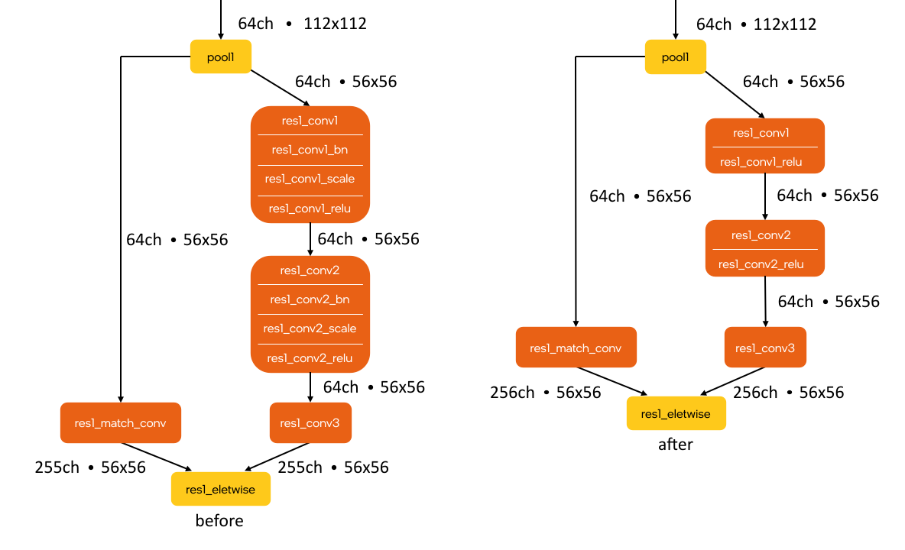
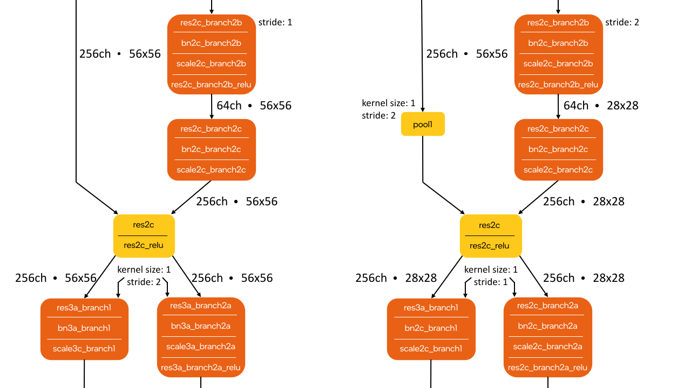
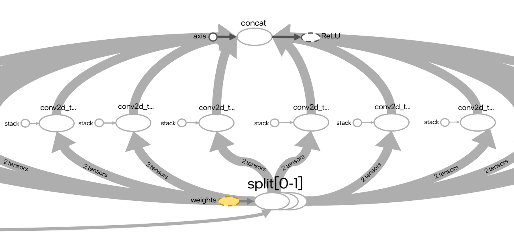
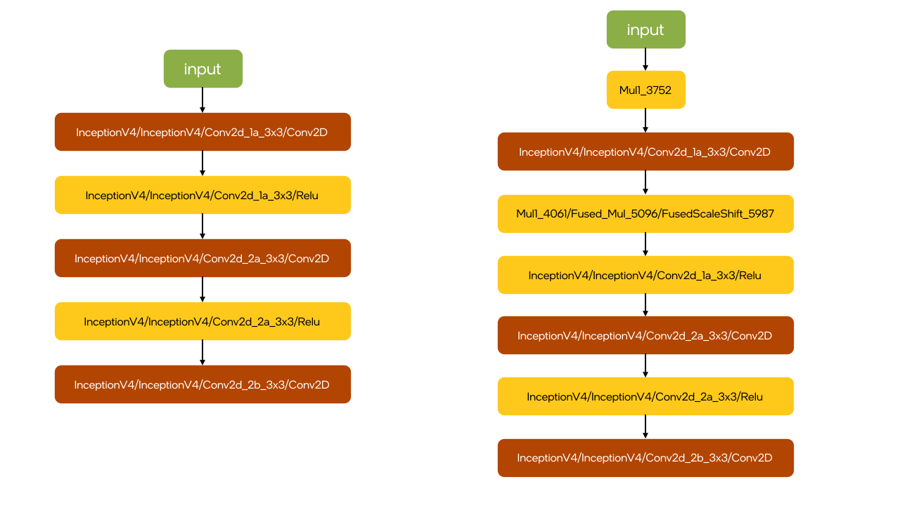

# Model Optimization Techniques  {#openvino_docs_MO_DG_prepare_model_Model_Optimization_Techniques}

Optimization offers methods to accelerate inference with the convolution neural networks (CNN) that do not require model retraining.
 
* * *

## Linear Operations Fusing

Many convolution neural networks includes `BatchNormalization` and `ScaleShift` layers (for example, Resnet\*, Inception\*) that can be presented as a sequence of linear operations: additions and multiplications. For example ScaleShift layer can be presented as Mul → Add sequence. These layers can be fused into previous `Convolution` or `FullyConnected` layers, except when Convolution comes after an Add operation (due to Convolution paddings).

### Usage

In the Model Optimizer, this optimization is turned on by default. To disable it, you can pass `--disable_fusing` parameter to the Model Optimizer.

### Optimization Description

This optimization method consists of three stages:

1. `BatchNormalization` and `ScaleShift` decomposition: in this stage, `BatchNormalization` layer is decomposed to `Mul → Add → Mul → Add` sequence, and `ScaleShift` layer is decomposed to `Mul → Add` layers sequence.

2. Linear operations merge: in this stage, the `Mul` and `Add` operations are merged into a single `Mul → Add` instance. 
    For example, if there is a `BatchNormalization → ScaleShift` sequence in the topology, it is replaced with `Mul → Add` in the first stage. In the next stage, the latter is replaced with a `ScaleShift` layer if there is no available `Convolution` or `FullyConnected` layer to fuse into next.
3. Linear operations fusion: in this stage, the tool fuses `Mul` and `Add` operations to `Convolution` or `FullyConnected` layers.   Note that it searches for `Convolution` and `FullyConnected` layers both backward and forward in the graph (except for `Add` operation that cannot be fused to `Convolution` layer in forward direction).

### Usage Examples

The picture below shows the depicted part of Caffe Resnet269 topology where `BatchNorm` and `ScaleShift` layers will be fused to `Convolution` layers.

* * *

## ResNet optimization (stride optimization)

ResNet optimization is a specific optimization that applies to Caffe ResNet topologies such as ResNet50, ResNet101, ResNet152 and to ResNet-based topologies. This optimization is turned on by default, and can be disabled with the `--disable_resnet_optimization` key.

### Optimization Description

In the picture below, you can see the original and optimized parts of a Caffe ResNet50 model. The main idea of this optimization is to move the stride that is greater than 1 from Convolution layers with the kernel size = 1 to upper Convolution layers. In addition, the Model Optimizer adds a Pooling layer to align the input shape for a Eltwise layer, if it was changed during the optimization. 

In this example, the stride from the `res3a_branch1` and `res3a_branch2a` Convolution layers moves to the `res2c_branch2b` Convolution layer. In addition, to align the input shape for `res2c` Eltwise, the optimization inserts the Pooling layer with kernel size = 1 and stride = 2.

* * *

## Grouped Convolution Fusing

Grouped convolution fusing is a specific optimization that applies for TensorFlow topologies. The main idea of this optimization is to combine convolutions results for the `Split` outputs and then recombine them using `Concat` operation in the same order as they were out from `Split`.

* * *

## Disabling Fusing

Model Optimizer allows to disable optimizations for specified nodes via `--finegrain_fusing <node_name1>,<node_name2>,...` (regex is also supported). Using this key, you mark nodes that will noy be touched by any optimizations.

### Examples of usage

On the picture below you can see two visualized Intermediate Representations (IR) of TensorFlow InceptionV4 topology.
The first one is original IR that will be produced by the Model Optimizer.
The second one will be produced by the Model Optimizer with key `--finegrain_fusing InceptionV4/InceptionV4/Conv2d_1a_3x3/Conv2D`, where you can see that `Convolution` was not fused with `Mul1_3752` and `Mul1_4061/Fused_Mul_5096/FusedScaleShift_5987` operations.

